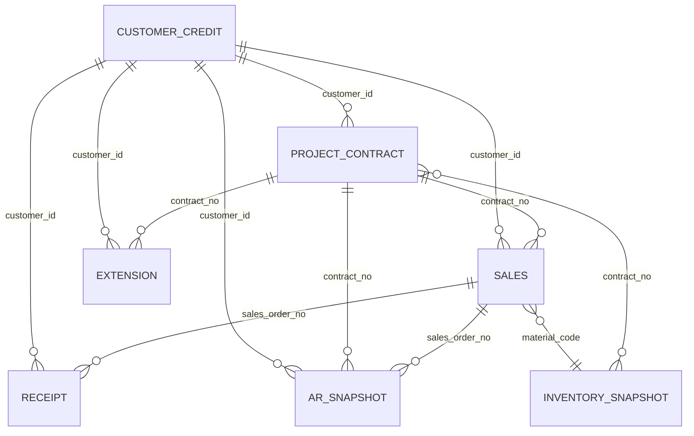
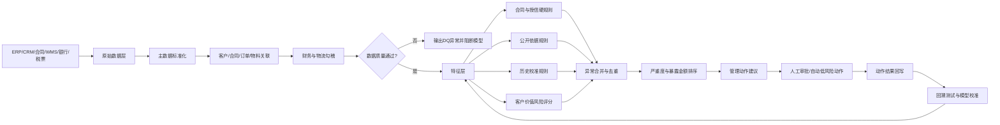
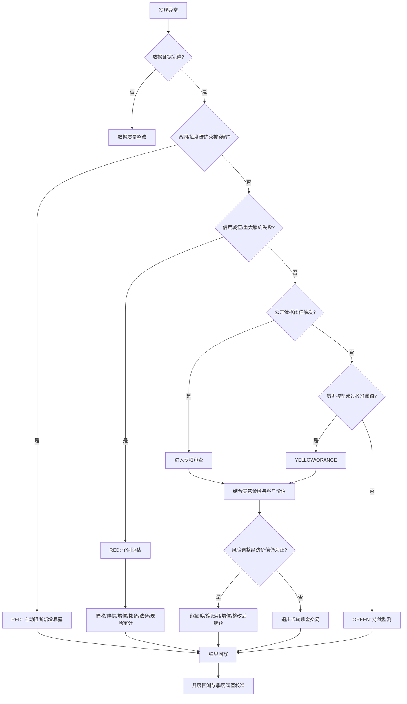

# 长虹佳华 ICT 分销与增值项目业务经营分析与财务风控规则手册

## 执行摘要

本手册面向长虹佳华 ICT 分销与增值项目业务的数据工程、经营分析、信用管理、财务风控及自动化 Agent 团队，目标不是对长虹佳华当前经营状况作结论，而是把公开披露的业务特征、会计政策、信用与库存管理实践，转换成**可计算、可回溯、可配置、可触发管理动作**的规则体系。

长虹佳华公开定位覆盖 ICT 产品流通、ICT 基础设施建设、云与数据智能等解决方案和服务，业务既包括渠道型产品分销，也包括从方案设计、实施、交付到运维的增值服务，因此不能用同一套周转、毛利、库存和回款阈值评价两类业务。 citeturn1view2turn18search8

本手册确立六条核心原则：

**其一，分销与项目必须分轨分析。** 渠道分销以“销量—毛利—库存—应收—资金占用”作为主链；增值项目则以“合同—履约义务—里程碑—验收—开票—回款—预计完工成本”作为主链。收入确认必须以控制权或履约义务满足为依据，而不能仅凭开票、销售订单或内部发货状态确认；IFRS 15 同样要求识别合同、履约义务、交易价格，并在控制权转移时或履约过程中确认收入。 citeturn25view4

**其二，信用风险必须按“合同到期日”计算，而不是简单把发票账龄当作逾期天数。** 四川长虹就长虹佳华 ICT 综合服务业务的公开回复显示，下游综合授信账期处于 **0—180 天**区间，因此“合同账期超过 180 天且没有专项审批”可作为公司公开依据型异常规则；但这绝不意味着“应收产生 90 天”就是逾期或违约。 citeturn21view3turn27search4

**其三，90 天以上逾期应进入高强度风险审查，但不能机械认定违约。** 长虹佳华 2025 年报披露，在客户财务状况强、还款记录良好且保持持续商业关系等情况下，公司可推翻对逾期超过 90 天应收款的违约推定；重大未清偿或已经发生信用减值的应收则进行个别评估。由此，本手册将“DPD≥90”设计为**红色审查触发器而非自动违约标签**。 citeturn22view3

**其四，库存必须区分消费类与企业增值类。** 公司公开回复明确，消费类 ICT 产品更新快，并将消费类产品库龄控制在 **55 天以内**；企业增值类产品生命周期明显不同。因此，55 天可以直接作为消费类库存管理的公开依据型异常边界，但不应机械移植到服务器、交换机及项目绑定类库存。公司同时披露按季度执行库存减值测试，并参考近期同型号售价、厂商指导价、电商及渠道价格、已签项目售价以及原厂价格保护政策。 citeturn21view0turn21view1

**其五，坏账风险模型必须与会计 ECL 体系衔接但不能把会计拨备率直接当授信规则。** 长虹佳华年报披露，对普通应收按相似信用风险特征、账龄和还款历史采用拨备矩阵估计全期预期信用损失，对重大余额及信用减值项目单独评估；IFRS 9 对应收账款亦提供全期 ECL 简化方法。 citeturn19view0turn22view3turn26view2

**其六，除公开披露和合同硬约束外，本手册不虚构统一行业阈值。** 低毛利率、DSO、项目延期天数、企业增值类库龄、展期次数、客户评分分界点等，应使用长虹佳华自身历史数据校准。最低启动数据建议为：**销售、回款、应收、授信至少 24 个月；库存至少 8 个季度快照；项目必须覆盖完整履约周期；展期及信用减值样本要完整保留。** 这属于本手册的实施数据要求，而非宣称存在行业统一标准。信用模型验证应同时检查区分能力、校准程度、回溯结果和数据质量；BIS 的信用评级验证研究亦把 backtesting、benchmarking、数据质量及评级使用过程视为模型验证的重要组成部分，并提醒违约样本稀缺会使统计校准困难。 citeturn25view0turn25view1turn26view0

本手册统一规定输出：

`rule_id + observation_date + business_type + customer_id + contract_no + sales_order_no + material_code + metric_value + benchmark_value + threshold_value + threshold_source + severity + reason_code + exposure_amount + evidence + management_action + action_owner + action_due_date + model_version + data_quality_flag`

其中阈值来源必须显式标记为：

- **公司公开依据**：来自年报、公开问询回复等，可直接作为基础规则；
- **行业经验**：仅作管理规则或候选比较标准，不应冒充公司现有制度；
- **需用历史数据校准的假设**：必须经过回溯测试后才能进入生产；
- 对合同约定、客户核定额度等，另标记为**合同/内部制度硬约束**，这不是统计阈值，不应通过模型擅自修改。

## 数据模型、字段口径与关联关系

七类数据必须首先落入统一的“客户—合同—订单—物料—时间”主数据框架。长虹佳华相关公开回复所披露的审计程序已经体现了这种证据链：销售流水需要与销售订单、出库单、客户确认文件勾稽，库存需要与采购、出入库及盘点记录核验，并执行客户/供应商函证、IT 审计及营运资金与现金流勾稽。 citeturn21view4

| 数据表 | 主键/关联键 | Agent 必需字段 | 首选数据来源 | 最低粒度与更新频率 |
|---|---|---|---|---|
| **销售表 `fact_sales`** | `sales_order_no`；关联 `customer_id / contract_no / material_code` | 业务类型、客户、合同、订单、物料、品牌/品类、渠道、订单日期、发货日期、签收/验收日期、收入确认日期、数量、未税收入、销货成本、折扣、返利、退货、物流成本、销售人员、项目编号、发票号 | ERP → 税务发票 → WMS/物流签收 → CRM/合同 | 订单行/日；日更 |
| **回款表 `fact_receipt`** | `receipt_id`；关联客户、订单、合同、发票 | 到账日、金额、币种、付款方名称/账号、收款银行、对应客户、发票、订单、合同、核销日期、核销金额、现金折扣、退款/冲销标志 | **银行回款记录优先** → 资金系统 → 财务 ERP | 银行流水笔/日；日更或准实时 |
| **应收月末快照 `snap_ar_monthly`** | `customer_id + invoice_id + month_end` | 原始应收日、合同到期日、原始到期日、当前到期日、余额、未核销金额、逾期天数、账龄、币种、坏账准备、信用减值标志、争议标志、抵押/担保 | 财务应收子账/总账 → 合同/授信系统 | 发票/客户/月；必须保存历史快照，禁止覆盖 |
| **库存季末快照 `snap_inventory_qtr`** | `warehouse_id + material_code + batch_id + quarter_end` | 物料、品牌、类别、消费/企业增值分类、入库日期、批次、数量、成本、库龄、最近销售日、在途/锁定量、项目绑定合同、市场价、原厂指导价、价格保护、NRV、跌价准备 | ERP/WMS → 财务成本 → 原厂政策/市场报价 → 项目订单 | SKU/批次/仓库/季；推荐同时保留月末快照 |
| **增值项目合同 `fact_project_contract`** | `contract_no`；关联客户、订单、物料 | 合同状态、签订/生效日期、合同金额、履约义务、交付范围、计划开始/结束、里程碑、验收条件、付款节点、预算收入/成本/毛利、已发生成本、预计剩余成本、变更单、验收日、开票日、回款日 | 合同系统 → CRM/项目管理系统 → ERP → 验收文件 | 合同/履约义务/里程碑；日或周更新 |
| **展期记录 `fact_extension`** | `extension_id`；关联客户、合同、应收项 | 原到期日、新到期日、展期天数、展期金额、原因、申请日、审批日、审批人、偿还计划、增信措施、是否因客户财务困难、展期后实收、再次展期标志 | 信用审批/OA → 财务应收 → 合同补充协议 | 单笔展期；事件驱动 |
| **客户授信 `dim_customer_credit_scd`** | `customer_id + effective_date` | 信用额度、账期、可用额度、评级、授信状态、审批日期/有效期、担保、抵押、外部评级、行业、渠道类型、实际控制人/集团关系、风险标签、停供标志 | 信用系统/CRM → 合同 → 外部征信 → 法务 | 客户/版本；使用 SCD2 保存历史 |

必须建立三个额外字段原则：

第一，`original_due_date` **永不覆盖**。任何修改只能写入 `current_due_date` 并生成展期记录，否则 Agent 将无法识别“改日期式隐性展期”。

第二，`business_type` 至少分为 `CHANNEL_DISTRIBUTION` 和 `VALUE_ADDED_PROJECT`；物料层再至少分为 `CONSUMER_ICT` 与 `ENTERPRISE_VALUE_ADD`。这是避免把 55 天消费库存规则错误套到企业项目库存上的关键。

第三，所有金额统一同时保留 `transaction_currency / local_currency_amount / fx_rate`；经营分析使用未税收入，现金风险分析使用真实资金口径。

实体关系建议如下：



## 核心经营与财务风控规则矩阵

以下规则是 Agent 的主执行清单。表中凡出现公开阈值均给出来源；没有可靠公开依据的数字，不设虚假“行业标准”。

**销售表规则**

| 分析主题 | 所需字段 | 计算方法 | 判断规则 | 输出结论 | 管理动作 |
|---|---|---|---|---|---|
| **S01 收入确认证据链** | 订单号、合同号、业务类型、发货/签收/验收日、收入确认日、履约义务、服务期间、退货权；ERP+物流+合同；订单/合同/日 | 分销：比较 `revenue_date` 与控制权转移证据日；项目：逐履约义务判断时点或时段确认 | 收入确认早于有效交付/验收/控制权证据，或项目没有履约义务映射即确认收入 → **红色**。阈值来源：**公司公开依据/会计准则**。IFRS 15 要求在控制权转移或履约义务满足时确认。 citeturn25view4 | `revenue_evidence_exception=1`；列出差异金额、合同、订单和缺失证据 | 暂缓新增收入确认；财务复核；补验收/签收证据；重大异常提交内审 |
| **S02 订单毛利与低毛利业务** | 未税收入、成本、折扣、返利、退货、物流、资金占用成本、ECL增量；ERP+财务 | `GP=净收入-COGS`；`GM=GP/净收入`；`CM2=GP-直接物流-资金占用成本-ECL增量-其他直接履约成本` | `CM2<=0` → 经济亏损硬警报；或 `CM2率 < 已批准业务底线` → 红色；无内部底线时用同业务/品牌/渠道历史分布校准低毛利阈值。来源：**需用历史数据校准的假设** | 低毛利/负贡献订单、客户、SKU及原因拆解 | 暂停同条件报价；重新议价；争取原厂返点/价格保护；调整账期；取消无经济价值订单 |
| **S03 毛利侵蚀来源** | 报价毛利、实际售价、成本、返利应收/实收、物流、价格保护、退货 | `margin_leakage = approved_GP - actual_GP`；拆成价格、成本、返利、物流、退货因素 | 差异绝对额或百分点超过该业务历史异常分位阈值 → 异常。来源：**需历史校准** | `leakage_driver=price/cost/rebate/logistics/return` | 对责任环节复盘；未兑现原厂返点追索；异常低价审批复核 |
| **S04 量价结构变化** | SKU、数量、实际单价、渠道、客户、品牌；订单/月 | `volume_effect=(Q_t-Q_0)*P_0`；`price_effect=Q_t*(P_t-P_0)`；结构效应作为剩余项或按 SKU 权重分解 | 增长主要由降价换量、且贡献利润不增长；或价格/销量变动进入历史异常区间 → 黄/红 | 销量增长、价格下降、结构升级/恶化的拆解 | 调整销售考核，从收入额转为贡献利润+回款；复核促销 |
| **S05 客户/品牌/SKU集中度** | 收入、毛利、客户、品牌、SKU、渠道；月/季 | `share_i=x_i/sum(x)`；`HHI=sum(share_i^2)`；同时计算 Top-N | 不使用统一 HHI 数字；与董事会限额、历史分布及压力情景比较。突然集中上升或单一客户损失可导致利润/现金流显著波动时报警。来源：**需历史校准** | 集中度趋势、最大风险暴露主体 | 限制新增单一客户暴露；拓宽渠道/供应商组合；压力测试 |
| **S06 退货/折让异常** | 销售额、退货额、折让、退货原因、SKU、客户、销售员 | `return_rate=退货未税金额/原销售未税金额`；同 cohort 比较 | 高于同品牌×渠道×产品生命周期历史异常分位，或期末集中退货 → 异常。来源：**需历史校准** | 退货异常客户/SKU/人员 | 锁定相关收入确认；核查渠道压货、虚假销售、价格保护及质量问题 |
| **S07 收入—信用条件错配** | 销售订单、客户信用额度、批准账期、实际订单账期、AR余额 | `post_order_exposure=现有暴露+新订单信用金额` | 订单条款突破授权额度/账期却没有审批记录 → 红色。公开披露的综合授信账期范围为 0—180 天，可把 `term_days>180` 且无专项审批直接列为例外。来源：**公司公开依据**。 citeturn21view3turn27search4 | `credit_override_exception=1` | 冻结订单释放；重新走授信审批；原则上不得以销售目标替代信用审批 |

**回款表规则**

| 分析主题 | 所需字段 | 计算方法 | 判断规则 | 输出结论 | 管理动作 |
|---|---|---|---|---|---|
| **C01 银行回款与财务核销完整性** | 银行流水号、付款方、到账额、到账日、ERP凭证、客户、核销额 | `unmatched_amount=bank_amount-matched_amount`；`match_rate=matched/bank` | 银行已到账但超过内部银行对账 SLA 未入账/未核销；或一笔资金被重复匹配 → 红色数据/财务控制异常。SLA 为**内部制度硬约束** | 未认领款、重复核销、跨客户错配 | 财务人工确认；冻结自动信用释放；修正客户余额 |
| **C02 按期回款率** | 合同应收节点、原到期日、应收金额、收款日、收款额 | 按到期 cohort：`on_time_rate=到期日前累计回款/到期金额` | 低于客户历史、同渠道或同信用等级的校准阈值；连续恶化升级风险 | 回款率趋势、拖欠客户 | D-期提醒；D+催收；触发授信复评 |
| **C03 实际收款周期与 DSO** | 应收余额、信用销售额、回款日；月 | 精细版：invoice-level `collection_days=receipt_date-invoice/control_date`；宏观版：`DSO=平均AR/信用销售额×期间天数` | 不能设置全公司统一 DSO 红线；渠道、电商与项目客户分层校准。持续高于同类历史区间或合同账期显著 → 黄/红 | 客户/渠道 DSO 及恶化来源 | 缩账期；提高预付款；现金折扣；减少信用销售 |
| **C04 现金折扣是否创造价值** | 应收额、原计划收款日、提前收款日、折扣额、资金成本、ECL差异 | `benefit=提前天数×金额×资金成本率/365 + ECL下降 + 其他资金收益`；`net_benefit=benefit-discount_cost` | `net_benefit<=0` 不建议给折扣；>0 才进入审批。公开回复表明长虹佳华已有通过现金折扣鼓励提前付款的管理实践。 citeturn20view4 | 折扣 ROI、资金节约额 | 调整折扣率和适用客户；只向具有正净收益的客户开放 |
| **C05 异常付款方与冲销** | 付款人名称/账户、客户法定名称、退款、冲销、反向流水 | 名称匹配+关联关系校验；监测“收到—快速退款—重新入账” | 非约定第三方付款、频繁冲销或期末异常大额回款 → 风控复核；具体次数阈值按历史数据校准 | `payment_party_exception` | 暂不自动释放授信；核验付款授权、真实交易与资金来源 |

**应收月末快照规则**

| 分析主题 | 所需字段 | 计算方法 | 判断规则 | 输出结论 | 管理动作 |
|---|---|---|---|---|---|
| **A01 真实逾期天数 DPD** | `original_due_date/current_due_date/as_of_date`、余额 | `DPD=max(as_of_date-current_due_date,0)`；另保留 `DPD_original=max(as_of-original_due,0)` | `DPD>0` 才是合同意义逾期；不得直接用发票账龄替代 DPD | 当前逾期与原始到期口径双输出 | 自动进入催收流程；保留原始到期口径防止展期“洗白” |
| **A02 90+逾期高风险审查** | DPD、还款历史、财务/评级、关系持续性、后续回款、信用减值标志 | `DPD>=90` 后生成审查包；检查 `financial_strength / stable_repayment / continuing_business / recoverability` | **DPD≥90=红色审查，不等于自动违约。** 公司年报明确存在满足条件时推翻90天违约推定的做法。阈值来源：**公司公开依据**。 citeturn22view3 | `90_plus_review_status`、是否具备反证 | 个别授信复核；没有充分反证则转个别ECL、法务催收、停供评估 |
| **A03 账龄迁徙与滚动恶化** | 连续月末快照、DPD bucket、余额 | `roll_rate(B_i→B_j)=下月迁入更差档余额/本月该档余额` | 同渠道/评级迁徙率超过历史控制区间或连续上升 → 预警。来源：**需历史校准** | Vintage/迁徙矩阵、恶化客户 | 提前催收；降低额度；缩短账期 |
| **A04 ECL/坏账准备合理性监控** | 余额、账龄、风险组、历史违约、前瞻变量、个别减值标志 | 集体：`ECL=EAD×loss_rate(segment,aging,forward)`；高级影子模型可用 `PD×LGD×EAD`；重大/信用减值客户个评 | 普通应收应用全期 ECL 矩阵；重大未清偿或信用减值项目单独评估。不得把 DPD=90 单独作为唯一违约标签。阈值来源：**公司公开依据**。 citeturn19view0turn22view3turn26view2 | 应计ECL、现有拨备、差额、模型版本 | 财务计提/转回评估；信用政策联动；重大客户个别评估 |
| **A05 信用风险集中度** | 客户/集团、AR、订单承诺、担保、评级 | `customer_exposure_share`、`group_exposure_share`、HHI | 超董事会/内部单户集中限额为硬异常；否则用历史及压力测试校准 | Top风险暴露、集团归集暴露 | 限额管理；要求担保；保理/保险评估；停止新增敞口 |
| **A06 应收勾稽完整性** | 期初AR、销售、回款、折让、退货、核销、坏账、期末AR | `expected_ending_AR=opening_AR+credit_sales-collections-credit_notes-writeoffs±adjustments` | 与账面期末 AR 不一致且无法由过账时间差解释 → 数据/会计红色异常 | reconciliation difference | 财务关账前清理；禁止用异常数据训练信用模型 |
| **A07 抵押/增信后净暴露** | AR、抵押物类型、评估价值、可执行性、担保人、优先级 | `secured_exposure=max(EAD-eligible_collateral×haircut,0)` | haircut 不用固定行业数；按抵押类型、司法可实现率及历史回收数据校准。公司年报披露部分应收存在物业抵押，可支持该字段设计。 citeturn22view3 | 毛暴露、净暴露、担保覆盖率 | 补充增信；更新估值；法务审查可执行性 |

**库存季末快照规则**

| 分析主题 | 所需字段 | 计算方法 | 判断规则 | 输出结论 | 管理动作 |
|---|---|---|---|---|---|
| **I01 消费类库龄 55 天控制** | 产品类别、入库日、快照日、批次、库存金额 | `inventory_age=as_of-inbound_date` | `CONSUMER_ICT` 且库龄 `>55天` → 至少黄色管理例外；若同时出现降价/新型号/无近期销售则红色。**不得把55天自动用于企业增值产品。** 来源：**公司公开依据**。 citeturn21view0 | 55天以上消费库存清单 | 减少采购；促销/调拨；申请价格保护；退换货谈判；NRV专项测试 |
| **I02 企业增值类呆滞库存** | SKU、库龄、项目绑定、最近销售日、生命周期、历史周转 | `days_since_last_sale`、`age_vs_peer` | 不设固定55天。阈值按产品族、项目绑定状态及历史正常库存年龄分布校准；进入历史高尾部且无有效项目需求 → 呆滞 | `enterprise_slow_moving=1` | 项目复核；跨区域调拨；供应商退货；停止补货 |
| **I03 可变现净值与跌价准备** | 成本、最新同型号售价、原厂指导价、电商/批发价、已签项目售价、销售必要成本、价格保护 | `NRV=预计售价-完成/销售必要成本`；`write_down=max(cost-NRV,0)` | `NRV<cost` → 应进入跌价准备测算；每季强制重新评估。IAS 2 要求按成本与可变现净值孰低计量；长虹佳华公开资料亦披露按季度结合上述市场信息测试。 citeturn19view0turn21view1turn25view3 | SKU级NRV、建议跌价准备、价格数据来源 | 财务计提；加速处置；原厂价格保护/退货谈判 |
| **I04 库存覆盖天数** | 可售库存、近期开销量、预测量、销售预测误差 | `DOS=available_qty/forecast_daily_demand` | 不设统一DOS阈值；选择使缺货成本+持有成本+跌价损失最低的阈值，并按产品族回测。来源：**需历史校准** | 过量/不足库存、未来需求覆盖 | 降采购、调拨、补货、动态安全库存 |
| **I05 库龄×毛利双杀识别** | 库龄、历史售价、当前报价、成本、价格保护、毛利 | `expected_exit_margin=(expected_sale_price-cost-selling_cost)/expected_sale_price` | 高库龄同时 `expected_exit_margin<=0` → 红色；高库龄+毛利进入历史低尾部 → 高风险。来源：硬经济约束+历史校准 | “高龄高亏损”SKU | 清库存优先级最高；停采；申请原厂补偿；必要时计提 |
| **I06 项目绑定库存异常** | contract_no、SKU、锁定量、项目状态、里程碑、验收计划 | 比较项目延期天数与绑定库存库龄；`stranded_inventory=bound_inventory if project_delayed/cancelled` | 项目已取消/暂停但库存仍锁定 → 红色；项目里程碑延期同时库存长期无动作 → 黄/红，天数阈值由项目历史校准 | stranded inventory amount | 解除锁定；重新销售/调拨；合同重谈；项目现场核查 |

**增值项目合同规则**

| 分析主题 | 所需字段 | 计算方法 | 判断规则 | 输出结论 | 管理动作 |
|---|---|---|---|---|---|
| **P01 合同关键要素完整性** | 合同号、客户、金额、履约义务、里程碑、验收标准、付款节点、预算成本、责任人 | 完整性校验；每个履约义务生成唯一 `performance_obligation_id` | 缺少验收、付款、成本预算或履约义务仍进入执行/收入确认 → 红色 | `contract_completeness_score`及缺失项 | 禁止项目转正式执行/收入确认；法务、财务补录 |
| **P02 项目收入确认与履约匹配** | 履约义务、硬件交付、验收、服务起止、收入确认额 | 商品类按控制权转移检查；独立服务按进度检查；`recognized_ratio` 对比 `satisfied_ratio` | 收入确认比例显著高于实际履约；或未验收即确认需要验收的项目 → 红色。来源：**公司公开依据/IFRS 15**。 citeturn25view4 | 提前/滞后确认金额 | 财务暂停确认；项目经理补履约证据；重大事项内审 |
| **P03 项目进度延期** | 计划/实际里程碑日、项目状态、责任方 | `delay_days=max(actual_or_asof-planned,0)`；有挣值数据时同时算 `SPI=EV/PV` | 以**合同宽限期**为硬阈值；无合同阈值时按同类型项目 delay 分布校准，不设置虚假“15/30天行业线” | 延期天数、关键路径、责任方 | 客户沟通；重排计划；升级项目治理；严重时现场审计 |
| **P04 成本超支和完工毛利恶化** | 预算成本、实际成本、ETC、合同收入、变更单 | `EAC=actual_cost+ETC`；`forecast_GP=contract_revenue-EAC`；`margin_erosion=approved_margin-forecast_margin` | `forecast_GP<0` → 红色；预测毛利低于批准底线 → 红色；其他差异阈值按项目回测 | EAC、预计最终毛利、超支原因 | 停止无审批扩项；合同重谈；供应商议价；管理层专项审批 |
| **P05 里程碑—开票—回款断点** | 里程碑完成、验收日、应开票日、实开票日、应收节点、回款 | `billing_delay`、`collection_delay`；形成里程碑 funnel | 已完成验收但未按合同开票；已开票但未到回款节点；到期未回款分别归因 | “履约未开票/已开票未到期/逾期未回” | 财务开票；商务获取验收；催收；信用联动 |
| **P06 未签变更导致范围蔓延** | 原合同范围、变更单、实际交付、追加成本、追加收入 | `unapproved_scope_cost=实际范围外成本-已批准变更覆盖成本` | 有新增交付/采购/人工成本但无有效变更单 → 红色 | 未审批范围、收入风险、成本暴露 | 停止继续扩项；取得客户签字；合同重谈 |
| **P07 项目现金暴露** | 项目累计采购/成本、已收预付款、已回款、应收、库存 | `cash_exposure=项目累计现金流出-项目累计现金流入` | 暴露突破项目批准资金预算 → 硬异常；否则以历史项目峰值暴露校准预警 | 项目峰值占款、预计回收期 | 提高预付款；拆分交付；停止下一阶段采购；申请增信 |
| **P08 验收异常** | 计划验收、实际验收、验收文件、拒收/整改原因 | `acceptance_delay=actual_or_asof-planned_acceptance` | 多次整改、验收文件缺失、客户拒签；阈值按项目类型历史校准 | 验收风险等级 | 现场审计；技术专项支持；确认是否需要预计损失/拨备 |

**展期记录规则**

| 分析主题 | 所需字段 | 计算方法 | 判断规则 | 输出结论 | 管理动作 |
|---|---|---|---|---|---|
| **E01 显性展期识别** | original_due、new_due、extension_amount、approval_id | `extension_days=new_due-original_due`；统计次数、金额和累计延长天数 | `new_due>original_due` 即为展期事实；没有审批ID → 红色硬异常 | 展期次数/金额/累计天数 | 补充审批；暂停新增信用销售 |
| **E02 改日期式隐性展期** | AR历史快照、original_due、current_due、展期表 | 比较相邻快照：`due_date_changed=1` 且不存在有效展期记录 | 到期日后移而无对应 `extension_id` → 红色 | `hidden_extension_type=DATE_RESET` | 恢复原始逾期口径；内控调查；授信复审 |
| **E03 滚动交易式隐性展期** | 老应收、销售订单、新回款核销顺序、新合同、额度 | 老款持续未降，同时继续发生新信用销售；检测“新款先核销、老款长期挂账” | 组合条件进入历史异常区间 → “疑似滚动占款”，只能作为调查信号，不能自动判定舞弊 | `hidden_extension_type=ROLLOVER` + evidence | 暂缓新增额度；要求还旧再发新；人工核实 |
| **E04 因财务困难给予优惠条件** | 展期原因、客户财务情况、审批意见、增信 | NLP/结构化标识 `financial_difficulty_concession=1` | 若展期本质是因客户严重财务困难提供原本不会给予的优惠，应进入信用减值个别评估。长虹佳华年报将因财务困难给予优惠条件列入信用减值证据之一。 citeturn19view0 | `credit_impairment_review_required=1` | 个别ECL；限制授信；增信；法务与催收联合 |
| **E05 展期后再次违约** | 新到期日、展期还款计划、实际回款 | `extension_performance=按新计划实收/计划应收` | 新到期日再次逾期 → 至少高风险；连续失败不设任意“第2/3次”线，严重度由损失率回测决定 | failed extension | 停供；取消自动展期权限；法务催收；拨备复核 |

**客户授信规则**

| 分析主题 | 所需字段 | 计算方法 | 判断规则 | 输出结论 | 管理动作 |
|---|---|---|---|---|---|
| **CR01 信用额度利用率** | 授信额度、AR、已发货未开票、信用订单、现金担保/可扣减增信 | `credit_exposure=AR+shipped_unbilled+released_credit_orders-eligible_cash_security`；`utilization=exposure/limit` | `utilization>100%` = 已突破批准额度，属于逻辑硬约束；公司年报披露由管理层团队确定并定期复核信用额度。 citeturn22view3 | 当前暴露、利用率、超额金额 | 自动停信用放单；必须审批追加额度或收款后发货 |
| **CR02 账期授权** | 客户批准账期、订单账期、合同账期 | `term_override=order_term-approved_term` | 超客户批准账期 → 硬异常；同时 `term_days>180` 且无特殊审批 → 公开依据异常。 citeturn21view3turn27search4 | 超账期订单 | 拒绝订单释放；专项审批或改现金/预付款 |
| **CR03 信用风险恶化信号** | 内/外评级、DPD、回款趋势、经营状态、司法/重组信息、行业变化 | 建立 feature flags；形成风险迁徙 | 外部/内部评级明显恶化、客户经营表现恶化、偿债环境不利、严重财务困难、违约、破产/重组等进入升级审查。上述因素与公司 2025 年报信用风险政策一致。 citeturn19view0turn20view1 | `credit_deterioration_reason_codes` | 缩额度/账期；现金结算；增信；停供；个别ECL |
| **CR04 建议授信额度** | 24个月销售、回款、峰值应收、合同账期、季节性、风险评分、担保 | `need_limit = 历史/预测正常峰值信用暴露`；`recommended_limit=min(业务需求额度, 风险上限, 内部集中上限)` | 不直接用“销售额×固定比例”。参数必须通过历史坏账和销售机会损失联合优化 | 当前额度、建议额度、差异及理由 | 自动生成调额建议，由授信人员审批，不由模型直接改主数据 |
| **CR05 客户价值—风险二维分层** | 贡献利润、收入、增长、产品广度、DPD、展期、ECL、利用率、项目风险 | 见下一节 `V_score` 与 `R_score` | 高风险硬触发优先于价值评分；不能因为客户收入高就覆盖信用减值事实 | V×R 九宫格 | 差异化额度、账期、催收及商务政策 |
| **CR06 停供与恢复** | 信用减值、超额、失败展期、逾期、回款、审批状态 | `stop_flag = hard_trigger OR calibrated_high_risk` | 已发生信用减值、突破额度未批准、展期后再次严重违约等进入停供审查；恢复必须满足收款/增信/审批条件 | stop/release + reason | 停止新增信用订单；改预付款；达到恢复条件后双人复核解锁 |

公开资料也表明，长虹佳华在营运资金管理中采用过现金折扣、ERP 动态需求研判，以及根据客户资信变化调整信用政策、对资信恶化客户收紧账期或转现款结算等措施，因此这些管理动作与其公开披露的管理思路具有一致性。 citeturn20view4

## 客户价值—风险分层、逾期预警与专项识别算法

客户不能简单按收入排序。对于资金密集、低毛利的 ICT 分销业务，大客户可能同时是高收入、高应收、高资金占用客户；真正需要最大化的应是**风险调整后的经济贡献**，而不是账面销售额。公开问询回复将 ICT 分销概括为薄毛利、快周转、资金密集型业务，并指出上下游账期错配造成营运资金占用，因此本手册把资金占用和信用损失纳入客户价值评价。 citeturn21view3turn27search4

**客户价值评分：**

\[
V=\sum_i w_i V_i,\qquad \sum_iw_i=1
\]

推荐特征：

`paid_gross_profit`、`CM2/economic_contribution`、`revenue`、`growth_stability`、`active_months`、`category_breadth`、`strategic_channel_flag`。

其中最重要的原则是：**已实现或风险调整后的利润优先于收入规模**。

每个连续变量不直接使用原始值，可使用本公司经验分布转换：

\[
score_i=100\times ECDF(x_i)
\]

对“越小越好”的指标反向处理。价值权重 `w_i` 不在本手册虚构数字；应通过历史利润稳定性、客户留存和管理目标校准。

**客户风险评分：**

\[
R=\sum_j v_jR_j,\qquad \sum_jv_j=1
\]

候选风险特征至少包括：

`max_DPD`、`overdue_balance_ratio`、`DPD90plus_ratio`、`roll_rate_to_worse_bucket`、`on_time_payment_rate`、`extension_count`、`failed_extension_rate`、`cumulative_extension_days`、`credit_utilization`、`ECL_ratio`、`rating_deterioration`、`project_acceptance_delay`、`cash_collection_volatility`。

风险模型首先应用**硬覆盖规则**：

```text
IF credit_impaired = 1
   OR approved_limit_breached_unresolved = 1
   OR failed_extension_high_severity = 1
   OR bankruptcy_or_restructuring_evidence = 1
THEN risk_tier = HIGH
ELSE risk_tier = model_or_rule_based_tier
```

不能把 `DPD>=90` 单独写进上述自动违约条件，因为公司公开会计政策明确对部分财务稳健、还款记录良好且维持持续关系的客户推翻 90 天违约推定。 citeturn22view3

客户价值和风险最终形成九宫格：

|  | 低风险 | 中风险 | 高风险 |
|---|---|---|---|
| **高价值** | 战略维护；在风险限额内支持增长 | 控制扩张；缩短边际账期；月度复评 | **不因价值高而豁免风险**；收款/增信优先，必要时停供 |
| **中价值** | 标准额度与账期 | 严控新增暴露 | 收款优先、降额、现金结算 |
| **低价值** | 自动化低成本服务 | 收缩信用资源 | 退出信用销售或退出业务 |

高/中/低价值以及中/高风险的分界点**不设固定 70/80 分等虚假数字**。应按下一节的方法，将阈值选到能够同时满足“信用损失上限、坏客户捕获率、销售机会损失、资金占用”目标的位置。

**逾期预警状态机**

```text
NOT_DUE
  ↓  到达预警窗口
PRE_DUE
  ↓  due_date已过且未足额支付
DPD_1_PLUS
  ↓
DPD_30_PLUS
  ↓
DPD_60_PLUS
  ↓
DPD_90_REVIEW
  ├─ 有充分反证 → HIGH_WATCH_BUT_NOT_DEFAULT
  └─ 无反证/信用减值证据 → INDIVIDUAL_ECL / COLLECTION / STOP_REVIEW
```

其中 D-提前提醒天数不要拍脑袋设置成“7天”或“15天”，Agent 参数命名为 `pre_due_alert_days`，根据历史付款提前量、客户规模、人工催收能力做收益—成本校准。

DPD 30/60/90 等档位适合监测迁徙与 vintage，但**真正的逾期起点永远是 DPD>0**。

**显性与隐性展期识别算法**

```python
for receivable in monthly_ar_history:

    # 显性展期
    explicit_extension = (
        receivable.current_due_date > receivable.original_due_date
        and exists_valid_extension_record(receivable)
    )

    # 无记录改日期
    date_reset_extension = (
        receivable.current_due_date > receivable.original_due_date
        and not exists_valid_extension_record(receivable)
    )

    # 老款滚动占用
    rollover_signal = (
        receivable.original_dpd > 0
        and new_credit_sales_after_due_date(receivable.customer_id) > 0
        and oldest_overdue_balance_not_materially_reduced(receivable.customer_id)
        and payment_allocation_skews_to_newer_invoices(receivable.customer_id)
    )

    # 因客户财务困难给予原本不会提供的宽限
    distressed_concession = (
        extension_reason_indicates_financial_difficulty(receivable)
        or credit_team_marks_distressed_concession(receivable)
    )
```

`date_reset_extension` 可以作为内控红色异常；`rollover_signal` 只能称为“疑似滚动展期”，必须人工调查，不能由算法自动定性为舞弊。

**授信调整触发器**

增加额度必须同时满足：价值高或业务需求确实增长、实际额度长期充分使用、按期回款表现稳定、无未解决高风险展期、风险评分在可接受区间，并且增加后的压力损失仍在风险偏好以内。

降低额度/缩短账期至少在以下情况启动：DPD持续恶化、90+审查没有充分反证、频繁或失败展期、ECL等级恶化、经营/外部评级显著恶化、项目验收严重延迟、客户实际经济贡献转负。长虹佳华 2025 年报列举的信用风险恶化因素包括内外部评级恶化、不利经营与财务环境变化、客户经营表现恶化以及重大监管、经济或技术环境变化等，可以直接转化为信用特征字段。 citeturn19view0turn20view1

立即停供或转现金结算，应以**硬事实而不是一个神秘模型分数**为核心，如未获审批的额度突破、明确信用减值证据、失败展期且没有新的还款/增信方案等。

## 阈值、权重与模型校准规则

任何标记为“需用历史数据校准的假设”的指标，在进入生产环境前都必须经过以下流程。

| 校准环节 | Agent/风控团队要求 | 通过条件 |
|---|---|---|
| **数据准备** | 销售、回款、应收和授信至少 24 个月；库存至少 8 个季度快照；最好保留月末库存；合同必须覆盖完整项目生命周期 | 时间连续、主键唯一、金额可勾稽；不足最低历史期只运行规则，不训练稳定评分模型 |
| **坏样本定义** | `bad_event` 优先采用信用减值、核销/撇销、破产重组、法律追偿、展期后实质违约等结果变量 | **不得把DPD90单独等同于违约**，以保持与公司公开政策一致。 citeturn22view3 |
| **时间切分** | 按时间建立训练期、验证期和最新 OOT 期；禁止只做随机切分造成未来信息泄漏 | OOT 仍维持稳定的排序能力和风险校准 |
| **分群** | 渠道分销/增值项目分别校准；消费/企业增值产品库存分别校准；客户按渠道、规模及风险特征分组 | 每组有足够稳定数据，否则合并，不为了“精细”制造小样本 |
| **特征检验** | 检查缺失率、单调性、极端值、信息泄漏、跨期稳定性 | 不能依赖只有坏账发生后才知道的变量预测坏账 |
| **区分能力** | ROC/AUC、KS、precision/recall 或 PR 曲线；同时看高风险组坏样本捕获率 | 不设未经验证的统一“AUC必须0.8”规则；与基线模型和历史版本比较 |
| **概率校准** | 比较各风险组预测概率与真实事件率；可使用 Brier score、校准曲线 | 预测与实际长期偏离时必须重校 |
| **阈值选择** | 扫描所有候选阈值，计算 FN损失、FP机会成本、占款、销售损失 | 使总预期经济损失最低，同时满足公司风险偏好 |
| **敏感性分析** | 对授信阈值、库存阈值、低毛利阈值做完整候选网格或经验分位扫描 | 管理结论不能只在极窄参数点成立 |
| **回溯测试** | 回算过去每个观察时点，当时只能使用当时可得到的数据 | 报告“当时若采用此规则，会拦截多少损失、误伤多少好业务” |
| **Champion-Challenger** | 现行规则为 Champion，新模型先 shadow run；不能直接替换核心授信决策 | 新模型连续多个观察期稳定后再审批上线 |
| **A/B测试** | 适合测试催收提醒时机、提醒渠道、现金折扣方案等低风险干预 | 对催收速度、客户体验、净经济收益显著改善才推广 |
| **模型监控** | 月度看评分分布、缺失率、坏样本率、等级迁徙；季度回测 | 漂移或校准失效触发再训练/回退 |

BIS 信用评级验证研究将模型设计、风险参数、backtesting、benchmarking、数据质量和实际评级使用过程纳入同一验证框架；相关研究还明确指出，风险模型既要验证债务人的**区分/分类能力**，又要验证概率的**校准准确性**，而违约样本稀缺本身会限制统计检验能力。 citeturn25view0turn25view1turn26view0

因此，本手册**不规定一个武断的“最少坏客户数”**。生产准入时应输出 bootstrap 置信区间；如风险率、AUC、召回率或分层实际损失率的置信区间过宽、跨期波动严重，就说明数据尚不足。此时应：

`合并过细分群 → 使用贝叶斯/平滑估计 → 降低模型复杂度 → 回退到公开规则+合同硬约束+人工审批`

而不是为了得到一个评分强行训练高维模型。

低毛利阈值可按以下经济目标校准，而不是使用固定“毛利率低于X%”：

\[
EconomicContribution
=
Revenue
-COGS
-DirectLogistics
-FundingCost
-IncrementalECL
-InventoryMarkdown
-DirectProjectCost
\]

\[
LowMarginThreshold
=
\arg\min_t
\left[
LossFromBadDeals(t)
+
OpportunityCostFromRejectedDeals(t)
\right]
\]

库存阈值同理：

\[
InventoryThreshold^*
=
\arg\min_d
[
HoldingCost(d)+MarkdownLoss(d)+StockoutCost(d)
]
\]

企业增值类库存尤其必须这么做。公开披露显示消费类与企业增值类产品迭代周期不同，故使用统一库龄线会系统性误判。 citeturn21view0

对于 ECL，不应把历史拨备比例直接复制到授信评分。年报披露的会计体系使用相似风险分组、账龄、还款历史、历史违约和合理前瞻信息形成拨备矩阵，同时对重大和信用减值余额单评；这意味着 Agent 应保留“会计ECL”和“经营信用分”两个相关但不同的输出。 citeturn19view0turn22view3

推荐字段：

```text
accounting_ecl_rate
accounting_ecl_amount
behavioral_risk_score
behavioral_pd_shadow
credit_decision_tier
credit_decision_reason
```

不得只输出一个不可解释的 `risk_score=83`。

## Agent 实现规范、SQL 与数据管道

Agent 应采取“**先证据勾稽，再计算指标；先硬规则，再统计规则；先建议，再审批**”的执行顺序。

标准输出表建议：

```sql
CREATE TABLE risk_rule_result (
    run_id               VARCHAR,
    rule_id              VARCHAR,
    observation_date     DATE,
    business_type        VARCHAR,
    customer_id          VARCHAR,
    contract_no          VARCHAR,
    sales_order_no       VARCHAR,
    material_code        VARCHAR,

    metric_name          VARCHAR,
    metric_value         DECIMAL(20,6),
    benchmark_value      DECIMAL(20,6),
    threshold_value      DECIMAL(20,6),
    threshold_source     VARCHAR,

    severity             VARCHAR,   -- GREEN/YELLOW/ORANGE/RED
    reason_code          VARCHAR,
    exposure_amount      DECIMAL(20,2),

    evidence_json        VARCHAR,
    recommended_action   VARCHAR,
    action_owner         VARCHAR,
    action_due_date      DATE,

    model_version        VARCHAR,
    rule_version         VARCHAR,
    data_quality_flag    VARCHAR,
    created_at           TIMESTAMP
);
```

**应收逾期与展期双口径 SQL：**

```sql
SELECT
    a.month_end,
    a.customer_id,
    a.contract_no,
    a.sales_order_no,
    a.invoice_id,
    a.ar_balance,

    GREATEST(
        DATEDIFF(day, a.current_due_date, a.month_end),
        0
    ) AS current_dpd,

    GREATEST(
        DATEDIFF(day, a.original_due_date, a.month_end),
        0
    ) AS original_dpd,

    CASE
        WHEN a.month_end <= a.current_due_date THEN 'CURRENT'
        WHEN DATEDIFF(day, a.current_due_date, a.month_end) <= 30 THEN 'DPD_1_30'
        WHEN DATEDIFF(day, a.current_due_date, a.month_end) <= 60 THEN 'DPD_31_60'
        WHEN DATEDIFF(day, a.current_due_date, a.month_end) <= 90 THEN 'DPD_61_90'
        ELSE 'DPD_90_PLUS'
    END AS current_dpd_bucket,

    CASE
        WHEN a.current_due_date > a.original_due_date
         AND e.extension_id IS NULL
        THEN 1 ELSE 0
    END AS hidden_date_reset_flag

FROM snap_ar_monthly a
LEFT JOIN fact_extension e
  ON a.customer_id = e.customer_id
 AND a.contract_no = e.contract_no
 AND a.invoice_id = e.invoice_id
 AND e.approval_status = 'APPROVED';
```

关键点是同时保留 `current_dpd` 和 `original_dpd`。否则客户经过数次展期后，系统只看到“尚未到期”，历史风险会被数据覆盖。

**信用暴露及超限 SQL：**

```sql
WITH ar AS (
    SELECT
        customer_id,
        SUM(ar_balance) AS ar_exposure
    FROM snap_ar_monthly
    WHERE month_end = :as_of_date
    GROUP BY customer_id
),

open_orders AS (
    SELECT
        customer_id,
        SUM(
            CASE
                WHEN order_status IN ('RELEASED', 'SHIPPED_NOT_BILLED')
                THEN credit_amount
                ELSE 0
            END
        ) AS committed_exposure
    FROM fact_sales
    WHERE order_date <= :as_of_date
    GROUP BY customer_id
)

SELECT
    c.customer_id,
    c.credit_limit,
    COALESCE(a.ar_exposure, 0)
      + COALESCE(o.committed_exposure, 0)
      - COALESCE(c.eligible_cash_security, 0)
      AS total_credit_exposure,

    (
      COALESCE(a.ar_exposure, 0)
      + COALESCE(o.committed_exposure, 0)
      - COALESCE(c.eligible_cash_security, 0)
    ) / NULLIF(c.credit_limit, 0)
      AS utilization,

    CASE
        WHEN (
          COALESCE(a.ar_exposure, 0)
          + COALESCE(o.committed_exposure, 0)
          - COALESCE(c.eligible_cash_security, 0)
        ) > c.credit_limit
        THEN 'RED'
        ELSE 'NORMAL'
    END AS limit_status

FROM dim_customer_credit_scd c
LEFT JOIN ar a
  ON c.customer_id = a.customer_id
LEFT JOIN open_orders o
  ON c.customer_id = o.customer_id
WHERE :as_of_date >= c.effective_from
  AND :as_of_date < COALESCE(c.effective_to, DATE '9999-12-31');
```

**低毛利订单 SQL/伪代码：**

```sql
SELECT
    sales_order_no,
    customer_id,
    contract_no,
    material_code,

    net_revenue,
    cogs,

    net_revenue - cogs AS gross_profit,

    net_revenue
      - cogs
      - direct_logistics_cost
      - estimated_funding_cost
      - incremental_ecl_cost
      - direct_project_cost
      AS economic_contribution,

    CASE
        WHEN net_revenue
           - cogs
           - direct_logistics_cost
           - estimated_funding_cost
           - incremental_ecl_cost
           - direct_project_cost < 0
        THEN 'NEGATIVE_CONTRIBUTION'

        WHEN contribution_margin
             < calibrated_low_margin_threshold
        THEN 'LOW_MARGIN'

        ELSE 'NORMAL'
    END AS profitability_flag

FROM mart_order_economics;
```

其中：

```text
estimated_funding_cost
=
average_credit_exposure
× annual_internal_funding_rate
× occupied_days
/ 365
```

资金成本率应来自财务/资金部门统一参数表，而不是 Agent 自己抓取某个市场利率临时替代。

**库存风险伪代码：**

```python
if product_type == "CONSUMER_ICT":
    if inventory_age_days > 55:
        alert("CONSUMER_AGE_EXCEPTION", source="公司公开依据")

if nrv < inventory_cost:
    provision_candidate = inventory_cost - nrv
    alert("NRV_BELOW_COST")

if product_type == "ENTERPRISE_VALUE_ADD":
    if (
        inventory_age_days > calibrated_age_threshold[product_family]
        and days_since_last_sale > calibrated_no_sale_threshold[product_family]
        and not valid_active_project_binding
    ):
        alert("ENTERPRISE_SLOW_MOVING")

if project_status in {"CANCELLED", "SUSPENDED"} and project_bound_qty > 0:
    alert("STRANDED_PROJECT_INVENTORY")
```

55 天规则只在消费类产品执行，是防止 Agent 最常见的“把公开数字跨场景滥用”错误。公司公开资料明确将消费类库龄控制与其较短产品迭代周期联系起来。 citeturn21view0

**项目异常计算：**

```text
EAC = ActualCost + EstimateToComplete
ForecastGrossProfit = ContractRevenue - EAC

ScheduleDelayDays =
max(ActualOrAsOfMilestoneDate - PlannedMilestoneDate, 0)

BillingDelayDays =
max(ActualInvoiceDate - ContractualInvoiceTriggerDate, 0)

CollectionDPD =
max(AsOfDate - ContractualPaymentDueDate, 0)

ProjectCashExposure =
CumulativeCashOutflow - CumulativeCashInflow

UnapprovedScopeCost =
CostForOutOfScopeDelivery - CostCoveredByApprovedChangeOrders
```

**Agent 总管道：**



特别要求：**数据质量失败不能被模型评分“掩盖”。** 销售订单、出库、确认、成本、库存及信息系统控制等数据链本身就是长虹佳华相关公开审计程序关注的对象，因此 Agent 必须把 `data_quality_flag` 作为规则执行前置条件。 citeturn21view4

## 可视化、异常处置与治理交付

最终 Agent 不应只输出一个 Excel 异常清单。最低可视化组件如下：

| 管理问题 | 必备可视化 | 横轴/纵轴或维度 | 主要用途 |
|---|---|---|---|
| 收入是否健康增长 | **销售额、GP、CM2时间序列图** | 月；分业务/品牌/渠道 | 区分增收、增利及“降价换量” |
| 收入结构变化 | **堆叠条形图** | 月×渠道/品类 | 分销与项目结构变化 |
| 哪些客户“收入高但不赚钱” | **客户热力图/散点图** | 收入/价值分 × CM2/资金占用 | 识别伪高价值客户 |
| 应收老化 | **逾期余额堆叠条形图** | 月×DPD档 | 看账龄结构恶化 |
| 风险迁徙 | **Vintage/迁徙热力图** | 起始月份×经过月数 | 提前看到新 cohort 质量变差 |
| 价值—风险组合 | **九宫格热力图** | V-score × R-score | 授信资源配置 |
| 展期风险 | **客户×月份热力图** | 月×客户；颜色=累计展期天数/失败率 | 看“展期依赖型”客户 |
| 库存老化 | **库龄堆叠条形图** | 季度×库龄层 | 看库存结构变化 |
| 库存经济风险 | **库龄×预计毛利热力图** | 库龄×exit margin | 找高龄低毛利/亏损 SKU |
| 库存与需求 | **库存覆盖天数时间序列** | 月/周×产品族 | 过量备货预警 |
| 项目履约 | **里程碑时间序列/Gantt** | 合同×时间 | 看延期和关键路径 |
| 项目经济性 | **项目热力图** | 进度偏差×预计毛利侵蚀 | 发现“越做越亏”项目 |
| 项目现金风险 | **现金暴露时间序列** | 项目生命周期×累计现金净流出 | 控制资金峰值 |
| 授信效果 | **风险等级×实际坏样本率校准图** | 预测等级×实际事件率 | 模型验证 |
| 阈值选择 | **ROC/PR曲线+成本曲线** | 阈值×损失/召回 | 不以单一AUC决定生产阈值 |

ROC/CAP、Brier score、backtesting 等方法在信用评级模型验证研究中分别用于检查分类能力和风险概率校准；但统计工具不能替代数据质量、人工信用判断与实际业务使用过程的验证。 citeturn25view0turn25view1

异常统一使用四级动作体系：

| 严重度 | 典型条件 | 最迟处理机制 | 标准管理动作 |
|---|---|---|---|
| **绿色** | 指标正常、无硬规则异常 | 自动监测 | 保持额度/库存/项目计划 |
| **黄色** | 指标进入校准预警区；消费类库存>55天但仍有健康销售；初期DPD恶化 | 进入责任人任务队列 | 提醒、原因标注、密集监测、限制边际扩张 |
| **橙色** | 多指标叠加；反复展期；毛利明显侵蚀；项目严重延迟；高库存+低毛利 | 风控/业务联合审批 | 缩账期、降额度、停止补货、重谈合同、专项催收 |
| **红色** | 未批准超限；收入确认证据缺失；信用减值；失败展期；NRV<成本且金额重大；项目预测亏损；项目取消形成绑定库存 | 即时升级 | 停供/现金结算、个别ECL、法务催收、计提、库存处置、合同重谈、现场审计 |

其中“现场审计”不能成为泛化动作，而应在以下证据组合下触发：项目交付状态与系统记录不一致、验收长期无法取得、项目库存长期滞留、实际成本与合同范围严重不一致、资金暴露持续增加却没有合理履约进展等。长虹公开回复中针对重大履约/经营异常也披露过现场尽调、停止新增资金暴露和动态跟踪的风险处置思路，可作为这种管理动作设计的公开依据。 citeturn15view0

最终决策流建议固定为：



Agent 每次规则运行还必须保留：

`source_snapshot_id`、`rule_version`、`threshold_source`、`threshold_version`、`model_version`、`input_timestamp`、`evidence_json`、`human_override_flag`、`override_user`、`override_reason` 和 `final_action_result`。

其中人工 override 必须可审计。特别是对“90+但公司认为仍可收回”“战略客户继续供货”“项目特殊延期”“特殊延长账期”等情形，系统不能简单删除风险标记；正确做法是保留原始规则命中，同时新增：

```text
rule_hit = TRUE
override_status = APPROVED
override_reason = ...
override_expiry_date = ...
approver = ...
next_review_date = ...
```

这样才能避免同一客户通过不断人工覆盖形成“永远不逾期、永远不超限”的数据假象。

本手册的最终治理原则是：**公开阈值负责建立底线，合同和内部授信负责形成硬约束，历史数据负责校准软阈值，模型负责排序，人工审批负责例外，但任何例外都不能修改原始事实。** 对长虹佳华而言尤其需要坚持这一点，因为公开披露已经同时表现出分销与项目服务、消费与企业增值产品、不同客户账期以及集体ECL与个别信用评估并存的业务结构，用单一毛利率、单一库存天数或单一逾期天数来管理全部业务，会在数据层面制造系统性误判。 citeturn1view2turn21view0turn21view3turn22view3