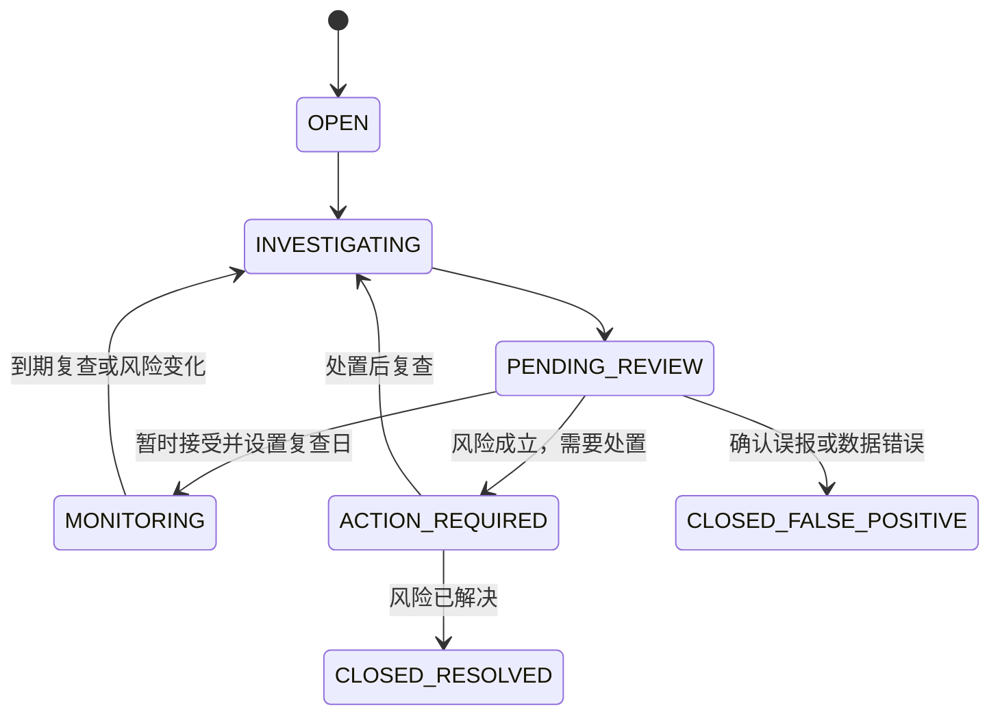

# 风险案件调查升级技术设计（实施基线）

## 1. 文档状态

本文描述 ICT Agent 从“经营看板 + 通用问数”升级为“规则发现风险 + Agent 调查原因 + 人工审核处置”
的实施基线。首期规则、案件库、调查 Agent、API 和页面已经按本方案实现。

已启用规则集为 `2026.08-v1`，阈值、回溯命中数量与选择依据见 `docs/risk-rule-baseline.md`，执行口径
已经同步到 `docs/metric-contract.md`。规则仍只用于创建候选调查案件，不是自动业务处置标准。

## 2. 升级目标

当前系统已经打通真实数据导入、DuckDB 确定性计算、Pydantic AI 工具调用、FastAPI 和演示页面，
但主要交互仍是“用户提问，模型选择一个汇总工具并解释”。升级后的产品主线应变为：


三个核心职责必须分开：

| 层次 | 负责 | 不负责 |
|---|---|---|
| 规则引擎 | 计算特征、执行规则、发现单点或组合异常、创建候选案件 | 猜测原因、生成管理结论 |
| 调查 Agent | 提出候选假设、选择下一项证据、调用固定只读工具、解释矛盾和缺失证据 | 计算金额、修改阈值、直接停供或调额 |
| 人工审核 | 接受、驳回或改写建议，决定处置和复查时间 | 修改原始事实、抹掉规则命中记录 |

## 3. 第一阶段产品范围

第一阶段只建设两个案件类型。

### 3.1 客户应收风险调查

目标是回答：

- 超期是短期时间差、持续恶化，还是长期老账未处理？
- 客户是否仍在持续回款，还是新增销售正在继续扩大风险敞口？
- 当前应收是否存在可匹配的展期记录？
- 白名单、失信分级、财务概况或信用保险是否构成缓释证据？
- 是否属于项目合同；合同状态、出库、回款和应收是否一致？
- 哪些解释无法由七表证实，还需要财务、验收或外部信用系统补证？

### 3.2 公司库存积压调查

目标是回答：

- 库存增加是否同时伴随销售速度上升和新库存入库？
- 库存是否向高库龄区间迁移，是否存在 180 天以上长期无销售物料？
- 是否出现库存增长、销售下降、退货增加或毛利侵蚀的组合信号？
- 当前证据更支持“正常补货”还是“滞销积压”？

这里的库存是公司仓库库存，不是下游客户库存。赛事数据不包含促销活动、下游动销或下游库存，
因此 Agent 不得把库存增长解释为“双十一备货”等具体活动，只能输出“与需求增长一致”之类的证据化
推断，并明确缺失促销计划或渠道动销证据。

### 3.3 第一阶段不做

- 不判断银行款项是否已经到账但尚未核销，因为没有银行流水与财务核销两套数据。
- 不认定项目未验收，因为没有里程碑、验收记录或验收文件。
- 不分析下游客户库存，也不归因到促销活动。
- 不接入工商司法、联网搜索、自由 SQL、代码执行或多 Agent。
- 不自动调额、停供、催收或修改业务系统数据。
- 不把白名单、授信额度或模型生成的置信度单独当作放行依据。

## 4. 规则引擎设计

### 4.1 先构建风险特征层

规则不直接在页面或提示词里临时拼接 SQL。系统先按固定观察期生成可测试的风险特征，再由规则读取。

第一阶段特征粒度建议为：

| 特征实体 | 观察粒度 | 主要来源 |
|---|---|---|
| 客户风险特征 | 客户 × 月末 | 应收、销售、回款、展期、授信 |
| 应收明细特征 | 客户 × 合同 × 销售订单 × 月末 | 应收、回款、展期、销售 |
| 项目闭环特征 | 正式合同 × 月末 | 签约、销售、回款、应收 |
| 库存风险特征 | 物料 × 库存组织 × 季末 | 库存、销售 |

特征层只保存确定性事实，例如：

```text
latest_ar_amount
latest_overdue_amount
overdue_60_amount
max_overdue_days
ar_change_1m
ar_change_3m
recent_sales_amount
recent_payment_amount
payment_to_sales_ratio
extension_action_count
new_sales_after_overdue_amount
inventory_amount
inventory_change_qoq
stale_inventory_amount
fresh_inventory_amount
recent_material_sales_amount
material_sales_change_qoq
```

所有金额、比例、快照和关联规则继续服从 `docs/metric-contract.md`。跨表关联必须优先使用
客户编号、合同号和销售订单号，不能仅按客户名称或金额近似匹配。

### 4.2 规则分为四类

#### A. 硬事实规则

不依赖统计模型，例如：

- 黑名单客户仍存在新增信用销售或未结应收；
- 授信额度为 0，但仍发生新增赊销；
- 已过最终承诺还款日期且仍有未结余额；
- 合同已取消，但仍存在未冲销出库或未结应收；
- 数据关联键、快照期间或金额勾稽失败。

这些规则仍需明确数据期间和业务语义，命中不代表自动执行停供。

#### B. 单指标阈值规则

例如超期天数、60 天以上超期金额、180 天以上库存金额。阈值必须标明来源：

```text
合同或内部制度硬约束
已冻结指标口径
公司公开依据
需要历史回溯校准的候选值
```

未经批准的候选值只能用于离线回溯，不能在页面上显示为公司的正式风险标准。

#### C. 跨表组合规则

单项正常但组合后出现风险是现实中常见的情况，因此组合规则必须能独立创建案件，不要求先命中某个
单指标红线。

典型组合包括：

```text
应收余额尚未超线
+ 回款速度连续下降
+ 新增销售持续增加
+ 展期动作增多
= 信用敞口正在积累
```

```text
库存金额尚未超线
+ 库龄结构持续上移
+ 同物料销售速度下降
+ 退货或毛利侵蚀增加
= 早期滞销风险
```

组合规则的计算与判定仍由确定性程序完成。Agent 可以解释组合为什么值得调查，但不能自己临时发明
权重或阈值。

#### D. 相对自身基线的异常规则

同一绝对值对不同客户、产品线或物料的意义不同。第一阶段可以计算客户自身 24 个月、物料自身
8 个季度的变化特征，但是否启用分位数、中位数绝对偏差或其他异常边界，需要先回溯真实模拟数据。

基线异常只能表达“显著偏离自身历史，需要调查”，不能直接表达“已经违约”或“已经滞销”。

### 4.3 组合问题如何避免漏检

规则引擎每次扫描都要执行三步：

1. 计算单表和跨表特征，不等单项规则先命中。
2. 同时执行硬规则、单指标规则、组合规则和基线异常规则。
3. 按实体和观察日期合并命中结果，创建一个案件并附带多个 `rule_hit`，避免重复案件。

例如客户的每项指标都处于中间水平，但“应收上升 + 回款下降 + 新增销售增加”同时发生，组合规则仍可
创建案件。调查 Agent 随后再判断这是季节性波动、正常业务增长，还是风险敞口积累。

### 4.4 规则结果必须可审计

每次规则命中至少保存：

```text
rule_hit_id
rule_id
rule_version
observation_date
entity_type
entity_id
metric_values
threshold_values
threshold_source
severity
exposure_amount
source_tables
source_period
created_at
```

同一规则、版本、观察日期和实体重复运行时必须幂等，不重复创建案件。

## 5. 风险案件模型

### 5.1 案件不是一条告警

告警只说明规则命中；案件聚合一个实体在同一观察期内的多个告警，并承载调查、审核和处置过程。

建议的核心字段：

```text
case_id
case_type
entity_type
entity_id
observation_date
status
priority
exposure_amount
rule_hit_ids[]
investigation_version
created_at
updated_at
next_review_at
```

`priority` 用于队列排序，不等同于最终业务定性。风险金额只能来自确定性特征或规则结果。

### 5.2 状态流转



“暂时接受”不能删除规则命中，也不能直接标记为正常；必须进入 `MONITORING` 并保存批准原因、批准人、
有效期和下次复查时间。

## 6. 调查 Agent 设计

### 6.1 Agent 的输入

Agent 不接收一个模糊的“请分析风险”，而是接收结构化案件包：

```text
案件类型与实体
观察日期
规则命中和确定性特征
允许使用的调查工具
该案件类型的调查清单
最大工具调用次数
已有人工备注
```

### 6.2 Agent 的调查循环

1. 读取规则命中，选择适用的候选假设。
2. 判断每个假设需要哪些证据。
3. 调用最具体的固定只读工具。
4. 根据返回结果标记支持、反驳或证据不足。
5. 如出现新矛盾，选择下一项证据；达到调用上限后停止。
6. 输出结构化调查报告，不直接改变案件处置状态。

Agent 不允许执行自由 SQL。工具负责金额、比例、趋势和日期计算，Agent 只负责证据编排和解释。

### 6.3 应收案件候选假设

初始假设由案件类型的固定 playbook 提供，Agent 根据证据选择和扩展，不从空白开始自由发挥。

| 假设 | 需要的证据 | 七表支持程度 |
|---|---|---|
| 客户回款能力正在恶化 | 应收趋势、回款趋势、超期利息、名单与财务概况 | 支持 |
| 老账未清但客户仍在正常经营 | 老应收变化、新增销售、近期回款 | 支持 |
| 当前逾期已经合法展期 | 当前应收与展期按订单精确匹配、最终承诺日 | 支持 |
| 白名单或信用保险构成缓释 | 名单状态、原因、创建时间、信用保险 | 部分支持，仅当前状态 |
| 项目闭环导致付款节奏不同 | 正式合同、出库、回款、应收、合同状态 | 部分支持 |
| 银行到账但尚未核销 | 银行到账与财务核销 | 不支持，必须列为缺失证据 |
| 项目尚未验收 | 验收计划、记录和文件 | 不支持，只能列为待外部核实 |

### 6.4 库存案件候选假设

| 假设 | 需要的证据 | 七表支持程度 |
|---|---|---|
| 正常需求增长后的补货 | 同物料销售增长、库存增长、新库存占比 | 支持 |
| 长期滞销积压 | 库龄上移、180 天以上金额、近期销售下降 | 支持 |
| 退货导致库存回流 | 负销售、出库类型、事务处理类型 | 支持 |
| 大促或营销活动备货 | 活动计划、渠道动销、下游库存 | 不支持 |
| 项目绑定备货 | 库存项目编号、项目状态 | 当前实际数据不支持 |

赛事数据字典写明库存项目编号“部分为空”，但当前导入的 237,041 行库存数据中该字段全部为空。
在赛事方补充或修正数据前，不建立项目绑定库存规则。

### 6.5 固定调查工具

现有“大而全”的客户画像工具适合问数，但会把调查步骤全部藏在一次聚合里。升级后应提供更细的只读
证据工具，例如：

```text
get_customer_ar_history
get_receivable_order_details
get_customer_payment_behavior
get_order_extension_history
get_customer_credit_context
get_new_sales_exposure
get_contract_context
get_inventory_change
get_inventory_age_profile
get_material_sales_velocity
get_material_return_and_margin_context
```

每个工具继续返回 `summary / rows / sources / period / metric_definitions / warnings`，并额外生成稳定的
`evidence_id`，供调查报告逐条引用。

### 6.6 结构化调查结果

建议由 Pydantic 模型约束为：

```text
case_id
investigation_summary
hypotheses[]
  hypothesis_id
  statement
  status = SUPPORTED | WEAKENED | UNRESOLVED
  supporting_evidence_ids[]
  contradicting_evidence_ids[]
  missing_evidence[]
facts[]
limitations[]
recommended_priority
recommended_actions[]
requires_human_review = true
```

不得让模型自由生成一个 `confidence=87%`。如需置信度，使用“证据完整度”和“关键证据是否一致”的
确定性等级，例如 `LOW / MEDIUM / HIGH`，并由程序根据已取得证据计算。

## 7. 人工审核

审核页面至少支持：

- 接受 Agent 建议；
- 改为持续观察并设置复查日期；
- 升级为需要处置；
- 判定为误报或数据问题；
- 填写审核原因和下一步动作。

每次审核保存：

```text
review_id
case_id
decision
reviewer
reason
action
next_review_at
created_at
```

第一阶段是本地单用户演示，不新增登录、角色和权限系统。页面填写的审核人只是审计字段，不代表已经
实现身份认证；生产化时必须接入企业身份与权限系统。

## 8. 前端信息架构

当前经营看板保留为辅助入口，主导航调整为：

```text
风险总览 | 案件队列 | 案件详情 | 规则说明 | 经营分析
```

### 8.1 风险总览

- 待调查、待审核、持续观察、需要处置案件数；
- 按案件类型和优先级分布；
- 风险敞口金额；
- 最近一次规则运行时间和数据观察期；
- 数据质量警告。

### 8.2 案件队列

列表字段建议为：

```text
案件编号 | 类型 | 客户/物料 | 观察日期 | 触发规则 | 风险敞口 | 优先级 | 状态 | 更新时间
```

支持按类型、状态、优先级和观察日期筛选。队列首先展示需要人处理的案件，不把一般经营指标混在其中。

### 8.3 案件详情

```text
┌──────────────────────────────────────────────────────┐
│ 案件标题、状态、观察日期、风险敞口、操作按钮          │
├──────────────┬──────────────────────┬────────────────┤
│ 触发规则      │ Agent 假设调查       │ 人工审核       │
│ 原始指标      │ 支持/反驳/待核实     │ 决策           │
│ 数据期间      │ 证据引用             │ 原因           │
│ 规则版本      │ 缺失证据             │ 复查日期       │
├──────────────┴──────────────────────┴────────────────┤
│ 调查时间线：规则命中 → 工具调用 → Agent 报告 → 审核  │
└──────────────────────────────────────────────────────┘
```

通用聊天框降为案件内的“继续调查”入口。用户可以询问“为什么没有判为滞销”或“再查看最近三个月回款”，
但回答只能引用该案件允许访问的固定工具证据。

## 9. 数据与持久化边界

- 原始七表和分析 DuckDB 继续作为可重建、只读的业务事实库。
- 案件、调查和审核记录不得写入同一个可被全量导入替换的数据库文件。
- 第一阶段复用 DuckDB，使用单独的本地案件库文件，避免新增依赖。
- 业务数据导入失败不能破坏已有分析库，案件库也不得因重新导入被清空。
- 案件证据保存来源、期间、规则版本和摘要，不复制无关原始明细。
- 模型失败时保留规则案件，状态停在 `OPEN` 或 `INVESTIGATING`，允许人工查看确定性证据。

## 10. API 草案

以下仅定义职责，实施前需与前端页面一同冻结 Pydantic 契约：

| API | 用途 |
|---|---|
| `POST /api/v1/rule-runs` | 对已导入快照执行一次幂等规则扫描 |
| `GET /api/v1/cases` | 查询案件队列与筛选 |
| `GET /api/v1/cases/{case_id}` | 查询规则、证据、调查和审核详情 |
| `POST /api/v1/cases/{case_id}/investigations` | 触发或重新运行一次 Agent 调查 |
| `POST /api/v1/cases/{case_id}/reviews` | 提交人工审核和复查时间 |
| `GET /api/v1/rules` | 只读展示启用规则、版本和阈值来源 |

第一阶段不提供前端修改规则的接口。规则通过代码、指标契约和测试受控变更。

## 11. 安全与失败边界

- 模型只能调用注册的只读调查工具，不能访问任意 SQL、文件、网络或业务写接口。
- 所有查询参数经过 Pydantic 校验并使用参数化 SQL。
- 工具结果按案件最小必要范围返回，单次结果继续限制行数。
- 每次调查限制模型请求数、工具调用数和输出长度。
- Agent 建议不能直接触发调额、停供或催收动作。
- 人工覆盖必须保留原规则事实、原因、批准人、有效期和下一次复查日期。
- 数据缺失或关联失败时输出 `UNRESOLVED`，不得用常识补全具体业务原因。

## 12. 已冻结的首期产品决策

1. 每次七表导入成功后自动执行规则扫描，页面允许幂等重跑。
2. 首批阈值已在 24 个月/8 个季度真实模拟数据上回溯，形成 38 个案件、47 条命中。
3. 人工审核为本地单用户演示，不引入登录和企业权限系统。
4. 暂时接受案件不设统一复查天数，每次审核必须人工填写复查日期。
5. 风险总览作为默认首页，经营总览与通用问数保留为辅助入口。

## 13. 第一阶段验收标准

- 同一批数据重复扫描不产生重复案件。
- 至少有一个应收组合规则和一个库存组合规则能够创建案件。
- 每个案件可追溯到规则版本、观察日期、来源表和确定性指标。
- Agent 至少执行两步证据查询，并能输出支持、反驳和待核实三种假设状态。
- Agent 不得把白名单单独作为关闭逾期案件的理由。
- Agent 不得声称存在促销、下游库存、未核销回款或项目验收事实。
- 人工可以接受、升级、判为误报或转为持续观察；所有选择均保留原因和时间。
- 模型不可用时，规则案件和确定性证据仍可查看。
- Ruff、格式检查、mypy、pytest 全部通过；新增规则有固定七表夹具数值测试。
- 前端完成桌面和移动端检查，案件调查过程在页面上可完整演示。
