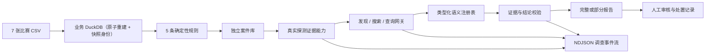

# 佳华智审风险调查 Agent 技术方案

## 1. 当前目标

系统用一个轻量规则集发现值得调查的异常，再由准确率优先的 Agent 完成证据调查。规则不负责复杂
定性，Agent 也不能修改规则或业务数据。完成标准不是“模型给出了答案”，而是能判断有证据的风险
信号、只对未知根因局部弃答、结论可引用、运行中断时不丢失已有证据，且过程可在页面观察和回放。

## 2. 技术与职责

| 层 | 实现 | 职责 |
|---|---|---|
| 页面 | 原生 HTML/CSS/JavaScript | 风险总览、案件、实时调查过程、报告回放、审核和经营看板 |
| HTTP | FastAPI + Pydantic | `/api/v1` 校验、错误映射、NDJSON 流和 OpenAPI |
| 应用服务 | `service.py` | 经营、扫描、案件、调查保存和审核用例 |
| Agent | Pydantic AI | DeepSeek 高强度思考、工具事件、结构化输出和输出校验 |
| 业务分析 | `semantic.py` / `tools.py` / `rules.py` | 单一语义注册表、参数化指标查询和版本化确定性规则 |
| 数据 | `data.py` | 业务 DuckDB 加固只读查询、带快照身份的原子导入、独立案件库写入 |

通用数据问答 Agent 已删除。经营看板继续直接调用确定性工具，避免无关工具进入案件调查上下文。

## 3. 数据与口径

业务库由 7 张正式 CSV 原子全量重建；案件、调查和审核保存在独立 DuckDB，导入业务数据不会覆盖
案件记录。合同号、客户号、订单号和物料号始终按字符串处理。金额单位不由模型判断，完全遵循赛事
官方数据字典，当前字段按“元”解释。快照、退货、零分母和关联规则见 `metric-contract.md`。

每次成功导入同时写入 `import_manifest`：稳定快照 ID、导入时间、七个来源文件的 SHA-256/行数/日期
范围，以及模式指纹。`GET /api/v1/data-snapshot` 与操作员 CLI 只返回文件名和哈希，不暴露本机路径。
业务只读连接固定关闭外部访问、社区/未签名扩展、扩展自动安装/加载和临时落盘，限制线程与内存后
锁定配置；模型从未获得连接或 SQL 入口。

## 4. Agent 调查协议

### 4.1 模型设置

- 唯一模型：DeepSeek `deepseek-v4-flash`，官方 Provider。
- Pydantic AI `thinking="high"`，准确率优先；思考模式不设置温度。
- 禁止并行工具调用，保证页面事件和证据顺序可审计。
- 每次最多 12 次模型请求、10 次工具调用和 40,000 个累计输出 token；高思考模式的推理 token 会跨
  多轮工具调用累计，不能使用只够单次回答的预算。
- 不实现模型 fallback、手写工具循环或私有消息协议。

### 4.2 冻结案件输入契约

规则存储模型在进入 Agent 前统一映射为 `InvestigationCaseInput 2.0`：案件编号、发现来源、类型、主体、
观察日、优先级、风险敞口、摘要、来源版本、信号列表和数据质量状态。每条信号包含名称、原因、严重度、
命中指标、阈值来源、数据来源和期间。当前规则案件使用 `discovery_source=RULE`；规则尚未提供独立数据
质量判断时显式写 `UNKNOWN`。

### 4.3 统一证据查询网关

应收与库存 Agent 都只注册三个动作：

1. `discover_evidence_capabilities`：针对当前案件和当前数据快照真实探测可用能力，返回数据集、单一
   粒度、指标、窗口、期间、可用状态和限制，不暴露物理表或 SQL。
2. `search_business_records`：只在当前案件关联记录内按业务标识包含搜索客户、合同、订单或物料；
   不搜索文件名、物理表、日志或任意数据库文本。
3. `query_business_evidence`：执行注册的受控查询，每次结果生成独立 `evidence_id`。

`semantic.py` 是唯一能力注册表，当前开放 9 个组合：应收的 `receivables/month`、
`receivables/order`、`sales_payments/month`、`extensions/order`、`credit/customer`、
`contracts/contract`，库存的 `inventory/quarter`、`inventory/age_bucket`、`sales/month`。
所有执行器均为后端固定参数化查询，自动锁定案件主体，不接收任意字段、关联、SQL、路径、正则或代码。

深度超期应收固定要求前三项核心证据加展期与授信；敞口积累固定要求前三项加合同与授信；库存固定要求
季度历史、最新库龄分桶和销售月度证据。相同查询及已被更宽指标集合覆盖的子集查询都会被拒绝。

### 4.4 证据与输出校验

每个工具返回结构化表格、来源、期间、口径、warning 和唯一 `evidence_id`，完整保存在调查记录中。
Pydantic AI 输出校验器拒绝以下报告并要求模型修正：

- 未发现当前快照的证据能力或未达到案件类型/信号要求的最低证据覆盖；
- 缺少独立风险信号判断，或其证据编号无效；
- 事实没有证据引用，或引用不存在的 `evidence_id`；
- `SUPPORTED` 无支持证据、`WEAKENED` 无反驳证据；
- 同一个证据编号同时出现在同一假设的支持与反驳列表；
- `UNRESOLVED` 没有说明缺失证据或证据冲突；
- 在缺少相应数据时直接断言已确认坏账、一定不可回收、停供、无回款能力或已进入诉讼程序。

报告展示四层信息：风险信号判断、工具直接证明的事实、证据支持的推测、明确无法判断的根因或结果。
白名单、授信、回款和信用保险只能作为缓释证据。历史展期不能替代当前订单精确匹配；库存不能虚构
促销或下游数据，也不能与特定客户应收建立数据不支持的因果关系。

### 4.5 部分报告

模型在取得至少一项工具证据后中断时，系统保留已经取得的证据，生成确定性的部分报告：证据摘要进入 facts；
最低覆盖完成时保留规则与证据共同支持的早期预警或恶化信号，根因固定为 `UNRESOLVED`；最低覆盖
未完成时标为 `LIMITED`。异常原文、密钥、路径、SQL 和堆栈不进入 HTTP 响应。

## 5. 调查事件流

`POST /api/v1/cases/{case_id}/investigations` 返回 `application/x-ndjson`。每行是一个带顺序号的
`InvestigationStreamEvent`：

- `RUN_STARTED`
- `TOOL_STARTED`
- `TOOL_COMPLETED`
- `VALIDATION_STARTED`
- `REPORT_COMPLETED`
- `ERROR`

最终 `REPORT_COMPLETED` 携带完整 `InvestigationRecord`。页面使用 Fetch Streams 增量解析；报告中的
trace 保存工具完成和报告校验轨迹，供刷新后回放。页面不展示模型私有思维链。

## 6. HTTP 接口

| 接口 | 说明 |
|---|---|
| `GET /api/v1/health` | 健康检查 |
| `GET /api/v1/data-snapshot` | 当前七表来源哈希与模式身份 |
| `GET /api/v1/overview` | 确定性经营看板 |
| `POST /api/v1/rule-runs` | 幂等规则扫描 |
| `GET /api/v1/risk/overview` | 风险总览 |
| `GET /api/v1/cases` | 案件队列 |
| `GET /api/v1/cases/{case_id}` | 规则、最新调查和审核历史 |
| `POST /api/v1/cases/{case_id}/investigations` | NDJSON 调查事件流 |
| `POST /api/v1/cases/{case_id}/reviews` | 人工审核和状态推进 |

通用 `/api/v1/chat` 已删除。

## 7. 评测与边界

`backend/evals/` 包含 3 个应收和 3 个库存冻结案件输入，从 Agent 调查入口开始，不执行规则扫描、
不读取案件库，也不评价规则引擎。单次结果按执行、调查策略、证据质量、引用与推理、结论边界、人工
交接六部分计 100 分，并设置完整运行、必要证据、引用、假设状态、禁用结论、可行动阶段和人工审核
七项硬门槛。运行器支持重复稳定性、重新评分、前后对比、人工复核模板和最终发布门槛；原始报告、
证据、耗时、Token、代码版本、评测集哈希与数据快照身份都进入已忽略的 `artifacts/`。
定向复跑可以在模型、评测集哈希和数据快照完全一致时替换完整产物中的对应运行，并记录全部来源
Run ID，既支持低成本回归，也不覆盖原始审计记录。

当前最终候选已完成 6 案 × 2 轮真实模型评测：12 次调查全部完整，自动门槛、人工语义复核与最终
发布门槛均为 12/12，六案跨轮阶段一致。与改造前同重复序号的 6 案相比，自动通过率从 66.67% 提升
到 100%，耗时下降 34.41%，双方用量完整的 5 案 Token 下降 42.65%。

操作员 CLI `backend/scripts/evidence_cli.py` 复用同一发现、搜索和查询函数，用于诊断与人工核对；CLI
不会被模型执行，且没有 SQL、文件读取或写操作参数。

当前不做登录、多租户、自由 SQL、RAG、联网、代码执行、多 Agent、自动数据刷新、模型 fallback、
预测评分或自动业务处置。新增能力不得破坏 CSV → DuckDB → 工具 → Agent → API → 页面主链路。
