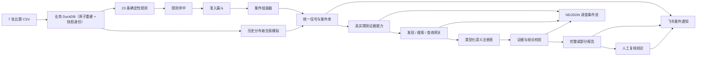

# 佳华智审风险调查 Agent 技术方案

## 1. 当前目标

系统接收企业预警、确定性规则或成交前交易信号，再由准确率优先的 Agent 完成证据调查。信号源不负责复杂
定性，Agent 也不能修改规则或业务数据。完成标准不是“模型给出了答案”，而是能判断有证据的风险
信号、只对未知根因局部弃答、结论可引用、运行中断时不丢失已有证据，且过程可在页面观察和回放。

## 2. 技术与职责

| 层 | 实现 | 职责 |
|---|---|---|
| 页面 | Vue 3 + Vite + Tailwind CSS 4 | 风险总览、统一案件队列、事前交易、独立案件处理页、流式 AI 审查、人工复核和经营看板 |
| HTTP | FastAPI + Pydantic | `/api/v1` 校验、错误映射、NDJSON 流和 OpenAPI |
| 应用服务 | `service.py` | 经营、信号入口、案件状态流转、调查保存、飞书通知和人工复核用例 |
| Agent | Pydantic AI | DeepSeek 高强度思考、工具事件、结构化输出和输出校验 |
| 业务分析 | `business_type.py` / `pretransaction.py` / `semantic.py` / `tools.py` / `rules.py` / `rule_engine.py` / `admission.py` / `case_assembler.py` | 交易级业务分类、纯计算模拟器、语义注册表、参数化指标查询，以及规则命中、准入和案件组装 |
| 数据 | `data.py` | 业务 DuckDB 加固只读查询、带快照身份的原子导入、独立案件库写入 |
| 飞书适配 | `feishu.py` | 官方长连接接收绑定指令，消息 API 主动发送结果卡片；不参与 Agent 调查推理 |

通用数据问答 Agent 已删除。经营看板继续直接调用确定性工具，避免无关工具进入案件调查上下文。

### 2.1 规则扫描三段式

规则扫描严格按以下方向流动，后层不能反向修改前层的业务判断：

1. `rules.py` 读取受控特征并执行冻结阈值，只产出不含 `case_id` 的 `RuleHit`；规则不创建案件，也不负责跨规则合并。
2. `admission.py` 执行入口治理：拒绝缺少主体身份的命中，去除同一主体、规则和版本的重复输出，并按稳定主体键形成准入信号组；不复制任何规则阈值。
3. `case_assembler.py` 将准入信号组映射为稳定案件编号、案件摘要和持久化 `RuleHitWrite`；案件优先级、敞口和信号关联只在这里组装。
4. `rule_engine.py` 只负责编排三步并生成扫描摘要，应用服务再把结果原子写入案件库。

该边界允许未来替换准入政策或接入外部命中源，而不要求规则函数知道案件存储结构。

## 3. 数据与口径

业务库由 7 张正式 CSV 原子全量重建；案件、调查和审核保存在独立 DuckDB，导入业务数据不会覆盖
案件记录。合同号、客户号、订单号和物料号始终按字符串处理。金额单位不由模型判断，完全遵循赛事
官方数据字典，当前字段按“元”解释。快照、退货、零分母和关联规则见 `metric-contract.md`。
规则扫描保存新结果时会在同一事务中清理遗留的 `RULE_SCAN` 来源 `CON|合同号` 案件及其孤立信号、调查、复核和通知记录；其他来源案件不受影响。

每次成功导入同时写入 `import_manifest`：稳定快照 ID、导入时间、七个来源文件的 SHA-256/行数/日期
范围，以及模式指纹。`GET /api/v1/data-snapshot` 与操作员 CLI 只返回文件名和哈希，不暴露本机路径。
业务只读连接固定关闭外部访问、社区/未签名扩展、扩展自动安装/加载和临时落盘，限制线程与内存后
锁定配置；模型从未获得连接或 SQL 入口。

## 4. Agent 调查协议

### 4.1 模型设置

- 唯一模型：DeepSeek `deepseek-v4-flash`，通过官方 OpenAI 格式端点
  `POST /chat/completions` 调用。
- 请求携带 `thinking.type=enabled` 与 `reasoning_effort=high`，准确率优先；思考模式不设置温度。工具调用轮次
  返回的 `reasoning_content` 由 Pydantic AI 按 DeepSeek Provider 规则自动回传。
- 三个本地工具均由 Pydantic AI 以 `sequential=True` 顺序执行，因此即使模型在同一响应内提出多个工具
  调用，实际查询、证据写入和页面事件仍按确定顺序完成。
- 最终输出使用 Pydantic AI `PromptedOutput(InvestigationReport)`。DeepSeek Provider 自动添加
  `response_format={"type":"json_object"}`，保证响应是 JSON；英文输出指令同时提供完整 JSON Schema 和
  一个仅表示结构的示例。Pydantic 继续校验字段结构，业务输出校验器继续核验证据与结论。
- 单次模型请求设置 `max_tokens=16,000`，为高强度思考后的结构化报告预留稳定空间；全程仍受
  40,000 个累计输出 token 的运行预算约束。
- 每次最多 12 次模型请求、10 次工具调用和 40,000 个累计输出 token；高思考模式的推理 token 会跨
  多轮工具调用累计，不能使用只够单次回答的预算。
- 不实现模型 fallback、手写工具循环或私有消息协议。

### 4.2 冻结案件输入契约

统一案件在进入 Agent 前映射为 `InvestigationCaseInput 4.0`。四个正交字段不得互相代替：

- `source` 只记录创建入口：规则扫描为 `RULE_SCAN`，事前交易模拟为
  `PRE_TRANSACTION_SIMULATION`，另保留 `EXTERNAL_ALERT` 和 `MANUAL`。
- `subject_type` 只描述主体粒度：客户、合同或“物料 × 库存组织”；主体编号、名称和受控查询上下文
  分别保存在 `subject_id`、`subject_label` 和 `subject_context`。
- 规则扫描的合同域信号按唯一客户编号归并到客户主体 `AR|客户编号`；合同号仍作为信号指标和案件上下文保留。
- `investigation_profile` 只选择证据策略：`RECEIVABLES`、`INVENTORY` 或 `PRE_TRANSACTION`。
- `business_type` 只在案件范围确实限定到单一交易业务时填写；客户级规则案件不得根据历史分布推断它。

其余字段包括观察日、优先级、敞口、摘要、来源版本、数据快照、信号列表和数据质量状态。每条信号包含
名称、原因、严重度、指标、阈值来源、数据来源和期间；数据质量 warning 必须进入报告限制。

### 4.3 统一证据查询网关

应收、库存和事前交易 Agent 都只注册三个动作：

1. `inspect_data`：针对当前案件和当前数据快照真实探测可用能力，返回数据集、单一
   粒度、指标、窗口、期间、可用状态和限制，不暴露物理表或 SQL。
2. `find_records`：只在当前案件关联记录内按业务标识包含搜索客户、合同、订单或物料；
   不搜索文件名、物理表、日志或任意数据库文本。
3. `get_evidence`：执行注册的受控查询，每次结果生成独立 `evidence_id`。

三项模型可见工具名称保持简短，工具说明、参数模型说明、系统指令和输出格式指令全部使用英文；业务
数据值与最终面向用户的报告文本继续使用中文。

`semantic.py` 是唯一能力注册表。除应收的 `receivables/month`、
`receivables/order`、`sales_payments/month`、`extensions/order`、`credit/customer`、
`contracts/contract` 与库存的 `inventory/quarter`、`inventory/age_bucket`、`sales/month` 外，事前交易
增加 `proposal/order` 和 `customer_profile/business_type`，并复用应收、同业务销售回款和授信能力。
所有执行器均为后端固定参数化查询，自动锁定案件主体，不接收任意字段、关联、SQL、路径、正则或代码。

深度超期应收固定要求前三项核心证据加展期与授信；敞口积累固定要求前三项加合同与授信；库存固定要求
季度历史、最新库龄分桶和销售月度证据；事前交易固定要求拟交易、同业务历史画像、应收、销售回款和
授信。相同查询及已被更宽指标集合覆盖的子集查询都会被拒绝。

### 4.4 证据与输出校验

每个工具返回结构化表格、来源、期间、口径、warning 和唯一 `evidence_id`，完整保存在调查记录中。
Pydantic AI 输出校验器拒绝以下报告并要求模型修正：

- 未发现当前快照的证据能力或未达到调查策略/信号要求的最低证据覆盖；
- 缺少独立风险信号判断，或其证据编号无效；
- 事实没有证据引用，或引用不存在的 `evidence_id`；
- `SUPPORTED` 无支持证据、`WEAKENED` 无反驳证据；
- 同一个证据编号同时出现在同一假设的支持与反驳列表；
- `UNRESOLVED` 没有说明缺失证据或证据冲突；
- 在缺少相应数据时直接断言已确认坏账、一定不可回收、停供、无回款能力或已进入诉讼程序。

报告展示四层信息：风险信号判断、工具直接证明的事实、证据支持的推测、明确无法判断的根因或结果。
白名单、授信、回款和信用保险只能作为缓释证据。历史展期不能替代当前订单精确匹配；库存不能虚构
促销或下游数据，也不能与特定客户应收建立数据不支持的因果关系。

### 4.5 部分报告

模型在取得至少一项工具证据后中断时，系统保留已经取得的证据，生成确定性的部分报告：证据摘要进入 facts；
最低覆盖完成时保留规则与证据共同支持的早期预警或恶化信号，根因固定为 `UNRESOLVED`；最低覆盖
未完成时标为 `LIMITED`。异常原文、密钥、路径、SQL 和堆栈不进入 HTTP 响应。

## 5. 调查事件流

`POST /api/v1/cases/{case_id}/investigations` 返回 `application/x-ndjson`。每行是一个带顺序号的
`InvestigationStreamEvent`：

- `RUN_STARTED`
- `TOOL_STARTED`
- `TOOL_COMPLETED`
- `VALIDATION_STARTED`
- `REPORT_COMPLETED`
- `ERROR`

最终 `REPORT_COMPLETED` 携带不含模型协议正文的轻量 `InvestigationRecord`。页面使用 Fetch Streams
增量解析；报告中的
trace 保存工具完成和报告校验轨迹，供刷新后回放。页面以顺序消息流展示可验证的审查进度；完成后
默认只展示结构化结论与处理建议，完整分析依据、工具证据和执行路径保持折叠可查。

每次调查另以 `InvestigationProtocolSnapshot 4.0` 保存最后一次模型 HTTP 事务，避免重复保存多轮请求中
高度重叠的累计历史。生产请求直接从 HTTP 层抓取发往 DeepSeek 的 Chat Completions 请求：方法、URL、
脱敏请求头和真实 JSON 请求体；其中 `messages` 包含英文系统指令、案件 JSON、助手工具调用、工具返回和
重试提示，`tools` 只包含 `inspect_data`、`find_records` 和 `get_evidence`。模型请求携带
`response_format={"type":"json_object"}`，最终轮返回普通 JSON 文本，不注册或调用 `final_result` 输出工具。
响应保存状态码、脱敏响应头和按顺序解析的全部 SSE 数据事件。案件详情和 `REPORT_COMPLETED` 事件不携带
完整协议；用户展开调试区时，页面才读取完整请求和响应摘要，完整事务由独立下载接口直接返回。这样既保留
开发调试与调查复盘证据，也避免数千个 SSE 增量进入默认页面渲染。协议快照保存在独立表中；
结构变更后不伪造、迁移或兼容旧版调查记录；读取历史案件时，非 4.0 协议对应的旧调查不作为
`latest_investigation` 返回，但案件、风险信号和人工复核历史继续保留。需要查看当前协议与工具记录时，
按现行流程重新调查生成 4.0 记录。

公开案件状态只有 `PENDING_AGENT_REVIEW`、`PENDING_HUMAN_REVIEW`、`ACTION_IN_PROGRESS` 和
`CLOSED`，页面对应待调查、待复核、处理中和已关闭。Agent 执行时数据库短暂使用
`AGENT_REVIEWING` 防止同一案件重复启动，但 API 将其归入待调查，不作为业务状态或筛选项。
完整或部分报告保存后进入待复核；未形成报告的失败运行恢复为待调查。人工确认风险后进入处理中，
证据不足返回待调查，确认无风险或误报则关闭。处理中表示调查系统已经完成交接，不在本系统建设或
跟踪工单和具体处置流程。服务启动时会把上一个进程异常退出所遗留的 `AGENT_REVIEWING` 临时状态
恢复为待调查，避免本地连接中断或服务重启后案件永久无法再次调查。

案件队列的 `signal_overview` 来自该案件最高严重度信号的名称，不由前端根据调查策略硬编码。
公开风险等级只显示低、一般、高；规则引擎内部的 `CRITICAL` 在 API 输出时统一归并为高。

## 6. HTTP 接口

| 接口 | 说明 |
|---|---|
| `GET /api/v1/health` | 健康检查 |
| `GET /api/v1/data-snapshot` | 当前七表来源哈希与模式身份 |
| `GET /api/v1/overview` | 确定性经营看板 |
| `POST /api/v1/rule-runs` | 幂等规则扫描 |
| `GET /api/v1/risk/overview` | 风险总览 |
| `GET /api/v1/cases` | 案件队列 |
| `GET /api/v1/cases/{case_id}` | 规则、最新调查和审核历史 |
| `POST /api/v1/cases/{case_id}/investigations` | NDJSON 调查事件流 |
| `GET /api/v1/investigations/{investigation_id}/protocol` | 按需返回完整请求和响应摘要 |
| `GET /api/v1/investigations/{investigation_id}/protocol/download` | 下载完整 HTTP 事务 JSON |
| `POST /api/v1/cases/{case_id}/reviews` | 人工审核和状态推进 |
| `GET /api/v1/pre-transaction/simulations` | 最近模拟新交易与对应案件 |
| `POST /api/v1/pre-transaction/simulations` | 按历史分布生成新交易并创建统一案件 |
| `GET /api/v1/integrations/feishu/status` | 飞书配置、长连接和通知群绑定状态 |
| `POST /api/v1/integrations/feishu/test` | 向已绑定群发送连通性测试卡片 |

健康度、名单建议、独立预警列表、静态模拟项目和通用 `/api/v1/chat` 已删除；它们不再构成第二套案件流程。
飞书卡片可跳转同一案件页。当前没有登录与飞书身份映射，因而不开放卡片内审批。

## 7. 评测与边界

`backend/evals/` 包含 3 个应收和 3 个库存冻结案件输入，从 Agent 调查入口开始，不执行规则扫描、
不读取案件库，也不评价规则引擎。单次结果按执行、调查策略、证据质量、引用与推理、结论边界、人工
交接六部分计 100 分，并设置完整运行、必要证据、引用、假设状态、禁用结论、可行动阶段和人工审核
七项硬门槛。运行器支持重复稳定性、重新评分、前后对比、人工复核模板和最终发布门槛；原始报告、
证据、耗时、Token、代码版本、评测集哈希与数据快照身份都进入已忽略的 `artifacts/`。
定向复跑可以在模型、评测集哈希和数据快照完全一致时替换完整产物中的对应运行，并记录全部来源
Run ID，既支持低成本回归，也不覆盖原始审计记录。

上一版模型协议候选曾完成 6 案 × 2 轮真实评测：12 次调查全部完整，自动门槛、人工语义复核与最终
发布门槛均为 12/12。切换到 DeepSeek Chat Completions、英文指令和 JSON Mode 后，已完成
`INV-83NN0001CD-MIXED-SIGNALS` 单案真实冒烟：报告完整、自动门槛通过、100 分；该结果只证明新协议
链路可运行，不替代发布前的 6 案 × 2 轮完整评测和人工语义复核。

操作员 CLI `backend/scripts/evidence_cli.py` 复用同一发现、搜索和查询函数，用于诊断与人工核对；CLI
不会被模型执行，且没有 SQL、文件读取或写操作参数。

当前不做登录、多租户、自由 SQL、RAG、联网、代码执行、多 Agent、自动数据刷新、模型 fallback、
预测评分或自动业务处置。新增能力不得破坏 CSV → DuckDB → 工具 → Agent → API → 页面主链路。
飞书只作为确定性的输入输出通道：群聊绑定和消息发送不改变核心调查 Agent 的工具、提示词和证据校验。
